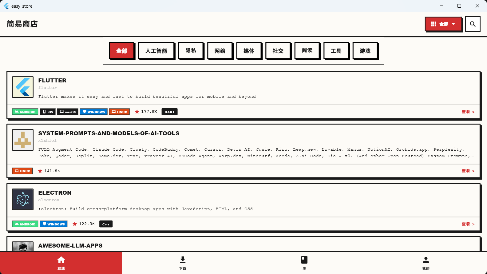
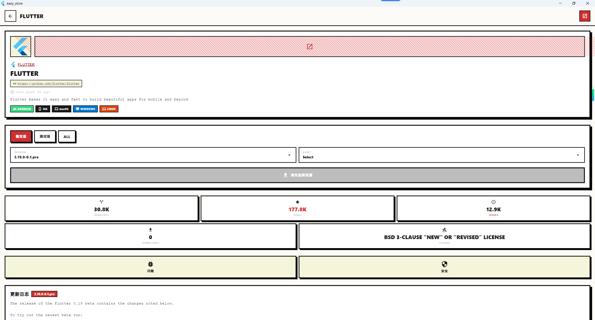
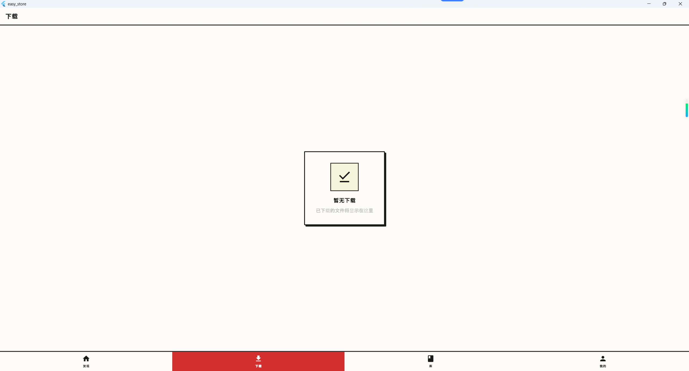
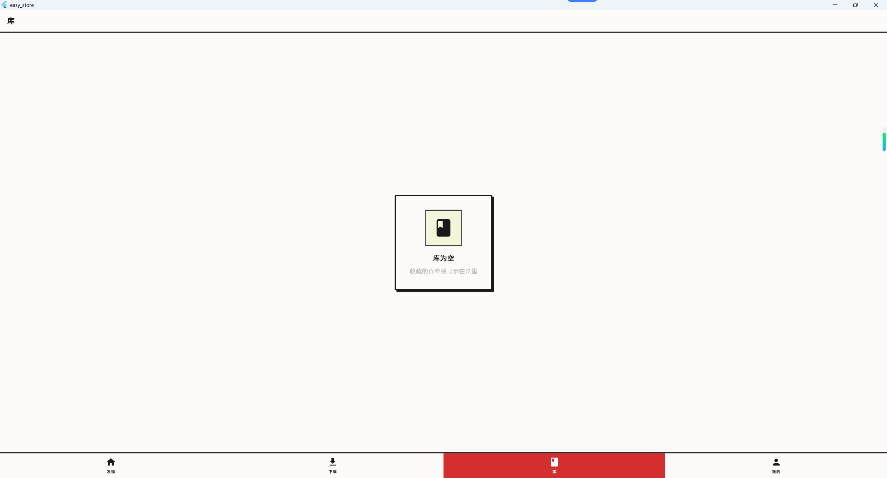
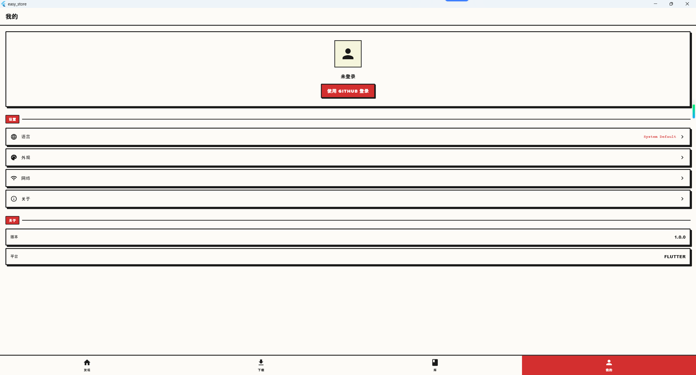
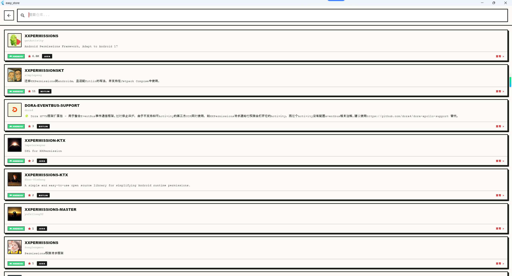
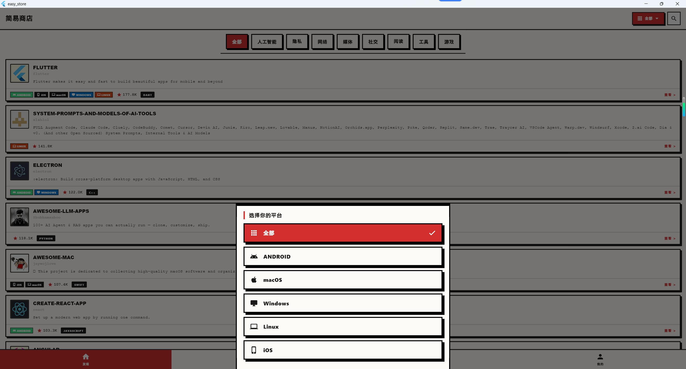

# Easy Store

一款免费、开源的 GitHub 应用市场，支持浏览、发现并安装 GitHub 上的开源项目。



## 功能特性

### 智能发现
- **分类浏览**：支持 AI、隐私、网络、媒体、社交、阅读、工具、游戏等多个分类
- **平台筛选**：支持按 Android、iOS、macOS、Windows、Linux 平台筛选
- **搜索功能**：支持按仓库名称、描述搜索 GitHub 开源项目
- **排序方式**：按星标数排序，快速找到优质项目

### 应用管理
- **一键安装**：直接下载并安装 GitHub 发布的 APK、EXE、DMG 等文件
- **版本选择**：支持稳定版、预览版、全部版本切换
- **下载管理**：查看下载进度和历史记录
- **库管理**：收藏喜欢的项目，查看已下载应用

### 丰富信息
- **README 展示**：完整展示项目 README，支持 Markdown 渲染
- **项目详情**：查看项目描述、星标数、Fork 数、Issues 等信息
- **开发者主页**：查看开发者信息和其他项目
- **问题追踪**：浏览和搜索 GitHub Issues
- **更新日志**：查看版本更新历史

### 多语言支持
支持 13 种语言：
- English、العربية、বাংলা、简体中文
- Español、Français、हिन्दी、Italiano
- 日本語、한국어、Polski、Русский、Türkçe

## 应用截图

| 首页 | 详情页 | 搜索 |
|:---:|:---:|:---:|
|  |  |  |

| 平台选择 | 设置 | 开发者主页 |
|:---:|:---:|:---:|
|  |  |  |

## 技术栈

- **框架**：Flutter 3.29+ 
- **状态管理**：Riverpod
- **网络请求**：Dio
- **UI 风格**：Manga/Neo-Brutalism（新粗野主义 + 漫画美学）
- **本地存储**：SharedPreferences
- **图片缓存**：cached_network_image
- **Markdown 渲染**：flutter_markdown

## 项目结构

```
lib/
├── core/                    # 核心层
│   ├── api/                 # GitHub API 封装
│   ├── models/              # 数据模型
│   ├── services/            # 业务服务
│   └── utils/               # 工具类
├── features/                # 功能模块
│   ├── home/                # 首页
│   ├── search/              # 搜索
│   ├── repository/          # 仓库详情
│   ├── downloads/           # 下载管理
│   ├── library/             # 库管理
│   ├── profile/             # 个人中心
│   └── auth/                # 认证
├── shared/                  # 共享组件
│   └── widgets/             # 通用 Widget
├── l10n/                    # 多语言文件
└── config/                  # 配置文件
```

## 开始使用

### 环境要求
- Flutter SDK 3.29+
- Dart SDK 3.11+

### 安装步骤

```bash
# 克隆项目
git clone https://github.com/dxmwl/Easy_store.git

# 进入项目目录
cd Easy_store

# 安装依赖
flutter pub get

# 运行应用
flutter run
```

### 构建 APK

```bash
flutter build apk --release
```

## GitHub OAuth 配置

如需使用 GitHub 登录功能，请按以下步骤配置：

1. 前往 GitHub Settings → Developer settings → OAuth Apps → New OAuth App
2. 应用名称填写任意名称
3. Homepage URL 填写：`https://github.com/dxmwl/Easy_store`
4. Authorization callback URL 填写：`easyestore://callback`
5. 创建后获取 Client ID
6. 在项目的 `local.properties` 文件中添加：
   ```
   GITHUB_CLIENT_ID=你的Client_ID
   ```

## 相关项目

| 项目 | 描述 | 语言 | Stars |
|------|------|------|-------|
| [qg_android](https://github.com/dxmwl/qg_android) | 青果短剧安卓端，看广告解锁、付费解锁，免费看短剧 | Kotlin | ⭐ 61 |
| [new_bee_upload_app](https://github.com/dxmwl/new_bee_upload_app) | 一键上传 APK 到多个应用市场 | Kotlin | ⭐ 43 |
| [yimulin_open_source](https://github.com/dxmwl/yimulin_open_source) | 一木林-多功能 AI 电子工具箱 | Kotlin | ⭐ 17 |
| [ttsq](https://github.com/dxmwl/ttsq) | 天天省钱淘客 Android 版 | Kotlin | ⭐ 9 |
| [tools_box](https://github.com/dxmwl/tools_box) | Flutter 常用工具集合 | Dart | ⭐ 2 |
| [Youkeyun_uniapp](https://github.com/dxmwl/Youkeyun_uniapp) | 友客云会员营销系统 | Vue | ⭐ 3 |
| [make_user](https://github.com/dxmwl/make_user) | 码客-程序员交流社区用户端 | Vue | ⭐ 1 |

## 开源协议

本项目采用 [Apache License 2.0](LICENSE) 开源协议。

## 贡献

欢迎提交 Issue 和 Pull Request 来帮助改进这个项目！

## 联系方式

- GitHub: [@dxmwl](https://github.com/dxmwl)
- Issues: [提交 Issue](https://github.com/dxmwl/Easy_store/issues)

---

**如果这个项目对你有帮助，请给个 ⭐ Star 支持一下！**
